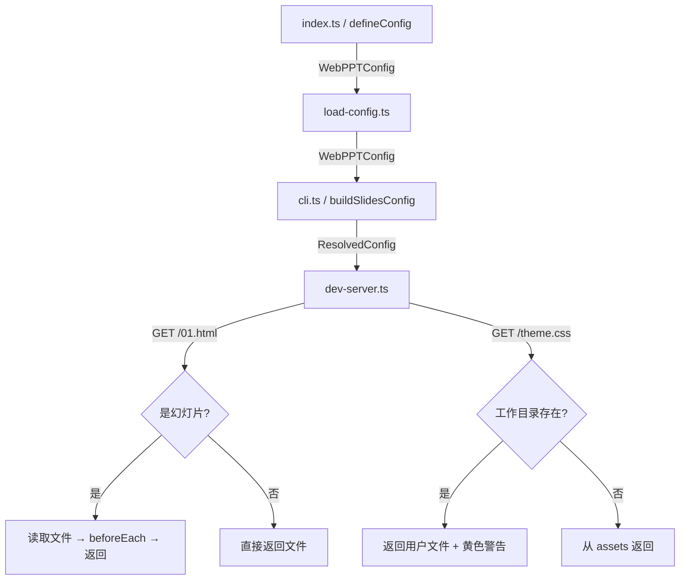
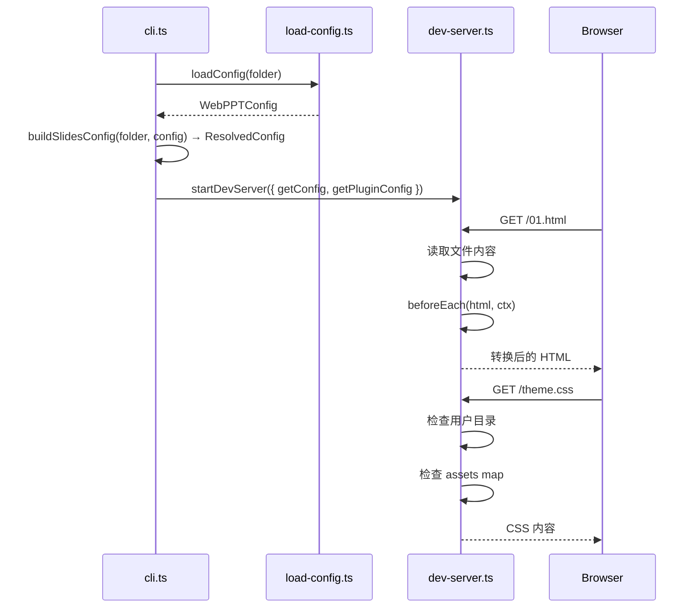

# Design：主题插件系统

## 架构概览



## 类型变更（types.ts）

```typescript
export type BeforeEachContext = {
  filename: string; // 如 "01.html"
  filepath: string; // 绝对路径
};

export type BeforeEachFn = (html: string, ctx: BeforeEachContext) => string | Promise<string>;

export interface WebPPTConfig {
  order?: (discovered: string[]) => string[]; // 移除 string[] 形式
  underlay?: string;
  overlay?: string;
  assets?: string[]; // 绝对路径数组
  beforeEach?: BeforeEachFn;
}

export interface ResolvedConfig {
  slides: string[];
  underlay?: string;
  overlay?: string;
  // assets 和 beforeEach 保留在 WebPPTConfig 中，不下发到浏览器
}
```

## cli.ts / buildSlidesConfig 变更

**保留文件集合**（从幻灯片列表排除）：

```typescript
const RESERVED = new Set(["overlay.html", "underlay.html"]);
const htmlFiles = entries.filter((f) => f.endsWith(".html") && !f.startsWith("_") && !RESERVED.has(f)).sort();
```

**order 处理**：

```typescript
const discovered = htmlFiles.map((f) => `/${f}`);
const slides = config?.order ? config.order(discovered) : discovered;
```

**overlay/underlay 自动检测**（与现有逻辑一致，文件名保持 `_` 前缀）：

```typescript
const underlayUrl = config?.underlay ?? (entries.includes("_underlay.html") ? "/_underlay.html" : undefined);
const overlayUrl = config?.overlay ?? (entries.includes("_overlay.html") ? "/_overlay.html" : undefined);
```

## dev-server.ts 变更

### assets 路由（优先级：用户目录 > assets）

在现有 `/*` 静态资源路由**之前**，插入 assets fallback 逻辑。

实际实现方式：沿用现有的 `/*` 路由，在路由处理内部：

1. 先尝试读取工作目录文件（现有逻辑）
2. 若不存在，查找 `assets` 数组中 basename 匹配的文件
3. 若存在冲突（工作目录和 assets 都有同名文件），打印警告后返回工作目录文件

```typescript
// 伪代码
const userFilePath = path.join(folder, pathname);
try {
  const content = await fs.readFile(userFilePath);
  // 检查是否有 asset 冲突
  const basename = path.basename(pathname);
  if (assetMap.has(basename)) {
    console.warn(`\x1b[33m[webppt] ⚠ asset "${basename}" 被工作目录同名文件覆盖\x1b[0m`);
  }
  return new Response(content, { headers });
} catch {
  // 尝试 assets
  const assetFile = assetMap.get(path.basename(pathname));
  if (assetFile) {
    const content = await fs.readFile(assetFile);
    return new Response(content, { headers });
  }
  return c.notFound();
}
```

### beforeEach 处理

在 `/*` 路由中，对幻灯片文件额外执行 `beforeEach`：

```typescript
const slideSet = new Set(resolvedConfig.slides);
const urlPath = `/${path.basename(filePath)}`;
if (beforeEach && slideSet.has(urlPath)) {
  const transformed = await beforeEach(content.toString("utf-8"), {
    filename: path.basename(filePath),
    filepath: filePath,
  });
  return new Response(transformed, { headers: { "Content-Type": "text/html" } });
}
```

### DevServerOptions 变更

```typescript
export interface DevServerOptions {
  folder: string;
  port: number;
  getConfig(): ResolvedConfig;
  getPluginConfig(): Pick<WebPPTConfig, "assets" | "beforeEach">; // 新增
  onFileChange?(): void | Promise<void>;
}
```

## 数据流



## 插件示例（参考，不在本次实现范围）

```typescript
// webppt-theme-simple/index.ts
import { join, dirname } from "path";
import { fileURLToPath } from "url";
import type { WebPPTConfig } from "webppt-cli";

const __dirname = dirname(fileURLToPath(import.meta.url));

export function simpleTheme(options: { title: string; thanks: string }): WebPPTConfig {
  return {
    assets: [join(__dirname, "theme.css"), join(__dirname, "cover.html"), join(__dirname, "thanks.html")],
    order: (slides) => ["/cover.html", ...slides, "/thanks.html"],
    beforeEach: (html, ctx) => {
      return html.replace("</head>", '<link rel="stylesheet" href="/theme.css"></head>');
    },
    overlay: "/overlay.html",
  };
}
```
