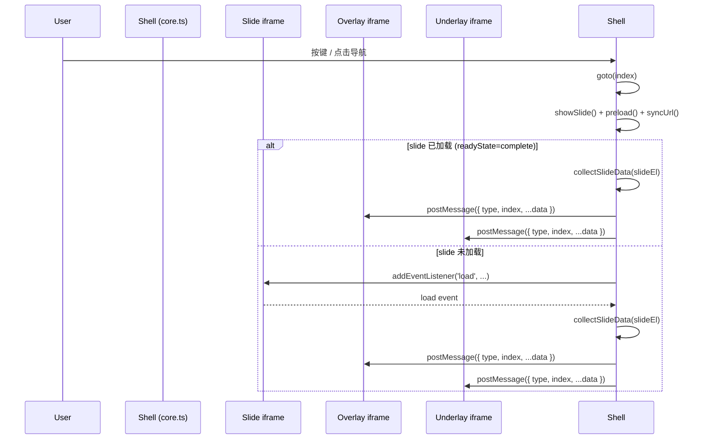

# 设计：Slide 元数据广播机制

## 架构总览



## 组件设计

### `collectSlideData(iframe: HTMLIFrameElement): Record<string, string>`

**职责**：从同源 iframe 的 contentDocument 中读取所有 `webppt:*` meta 标签，返回键值对。

**逻辑**：

```ts
export function collectSlideData(iframe: HTMLIFrameElement): Record<string, string> {
  const doc = iframe.contentDocument;
  if (!doc) return {};

  const data: Record<string, string> = {};
  const PREFIX = "webppt:";

  doc.querySelectorAll(`meta[name^="${PREFIX}"]`).forEach((el) => {
    const key = el.getAttribute("name")!.slice(PREFIX.length);
    data[key] = el.getAttribute("content") ?? "";
  });

  // <title> fallback
  if (!data.title && doc.title) {
    data.title = doc.title;
  }

  return data;
}
```

**导出**：`export`，方便单元测试直接调用。

---

### `broadcastSlideChange(index, slideEl, overlayEl, underlayEl)`（内部函数）

**职责**：读取 slide 数据并向 overlay/underlay 广播。

```ts
function broadcastSlideChange(
  index: number,
  iframe: HTMLIFrameElement,
  overlayEl: HTMLIFrameElement | null,
  underlayEl: HTMLIFrameElement | null,
): void {
  const data = collectSlideData(iframe);
  const msg = { type: "webppt:slide-change", index, ...data };
  overlayEl?.contentWindow?.postMessage(msg, "*");
  underlayEl?.contentWindow?.postMessage(msg, "*");
}
```

---

### `goto()` 修改

在现有 `showSlide / preload / syncSlideIndexToUrl` 之后追加广播逻辑：

```ts
const iframe = slideEls[index];
if (iframe.contentDocument?.readyState === "complete") {
  broadcastSlideChange(index, iframe, overlayEl, underlayEl);
} else {
  iframe.addEventListener("load", () => broadcastSlideChange(index, iframe, overlayEl, underlayEl), {
    once: true,
  });
}
```

**关键**：`{ once: true }` 确保不重复绑定。

---

### underlayEl 引用

类比 `overlayEl`，需要在 underlay iframe 创建时保留引用：

```ts
let underlayEl: HTMLIFrameElement | null = null;
if (underlay) {
  const el = document.createElement("iframe");
  // ... 同现有样式 ...
  underlayEl = el;
}
```

## 消息格式

```ts
interface SlideChangeMessage {
  type: "webppt:slide-change";
  index: number; // 0-based slide index
  title?: string; // 来自 <meta name="webppt:title"> 或 <title>
  [key: string]: unknown; // 任意 webppt:* 字段
}
```

## Overlay 接收示例

```html
<script>
  window.addEventListener("message", (e) => {
    if (e.data?.type !== "webppt:slide-change") return;
    document.getElementById("slide-title").textContent = e.data.title ?? "";
  });
</script>
```

## 测试策略（TDD）

jsdom 中 iframe 无法真实加载 HTML，需用以下技巧：

```ts
// 模拟 iframe 已加载，并写入 meta
function mockIframeWithMeta(iframe: HTMLIFrameElement, metas: Record<string, string>) {
  const doc = iframe.contentDocument!;
  // 写入 meta
  for (const [name, content] of Object.entries(metas)) {
    const meta = doc.createElement("meta");
    meta.setAttribute("name", name);
    meta.setAttribute("content", content);
    doc.head.appendChild(meta);
  }
}
```

测试 postMessage 使用 `vi.spyOn(overlayEl.contentWindow, 'postMessage')`。
