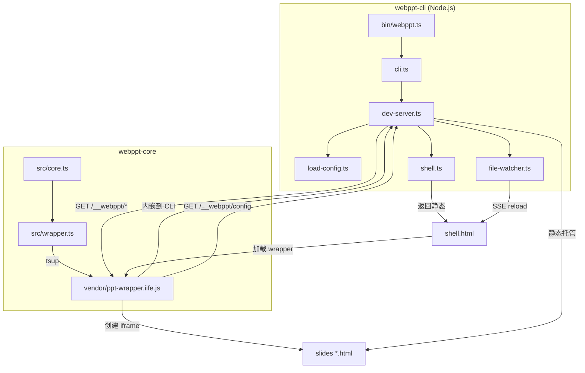

# 设计：webppt

## 架构总览



## 包结构

```
packages/
  webppt-core/
    src/
      core.ts           ← SlideDeck 核心实现（纯粹，无 CLI 依赖）
      wrapper.ts        ← CLI 桥接层：fetch config → 初始化 SlideDeck
    tsup.config.ts      ← 构建 wrapper.ts → dist/ppt-wrapper.iife.js
    package.json        ← 私有包，不发布 npm

  webppt-cli/
    src/
      cli.ts            ← argv 解析，入口
      dev-server.ts     ← Hono HTTP server + SSE
      shell.ts          ← 返回静态 shell.html 字符串
      load-config.ts    ← esbuild transform + dynamic import
      file-watcher.ts   ← chokidar 封装
      types.ts          ← WebPPTConfig, defineConfig
    bin/
      webppt.ts
    vendor/
      ppt-wrapper.iife.js  ← 由 webppt-core 构建后复制
    package.json

pnpm-workspace.yaml
```

## 技术栈

| 模块           | 技术                |
| -------------- | ------------------- |
| monorepo 管理  | **pnpm workspaces** |
| CLI 运行时     | tsx                 |
| HTTP server    | **Hono.js**         |
| 文件监听       | chokidar            |
| TS config 转换 | esbuild.transform   |
| CLI 参数解析   | commander           |
| 测试框架       | **vitest**          |
| 浏览器包打包   | tsup                |

## TDD 工作流

1. 先写失败的测试，修改实现直到测试通过
2. webppt-core 使用 **happy-dom**（jsdom 轻量替代）模拟 DOM 环境
3. webppt-cli 使用节点集成测试：启动真实服务器、请求 `http://localhost:<port>`、断言响应
4. 每个 task 对应独立测试文件（`*.test.ts`）

## 组件设计

### webppt-core：模块结构

`webppt-core` 分为两个模块：

- **`core.ts`**：纯粹的 `SlideDeck` 实现，接受 `SlideDeckOptions` 配置并渲染到 DOM。不知道 CLI 存在，可独立测试。
- **`wrapper.ts`**：CLI 桥接层，导入 `core.ts`，在初始化时自动 `fetch('/__webppt/config')` 获取配置并调用 `SlideDeck`。构建为 IIFE 后即自动运行，`shell.html` 只需一个 `<script src>` 就完成全部初始化。

### webppt-core：`SlideDeck`（core.ts）

```ts
interface SlideDeckOptions {
  el?: string | HTMLElement; // 挂载容器，默认 document.body
  slides: string[]; // slide URL 列表，由 CLI 注入
  underlay?: string; // underlay iframe 的 URL（由 CLI 注入，可选）
  overlay?: string; // overlay iframe 的 URL（由 CLI 注入，可选）
}

interface SlideDeckInstance {
  next(): void;
  prev(): void;
  goto(index: number): void;
  current(): number;
  destroy(): void;
}

function SlideDeck(options: SlideDeckOptions): SlideDeckInstance;
```

**DOM 结构**（挂载后）：

```
<div class="sd-deck">            ← 容器，position:fixed, inset:0
  <iframe class="sd-underlay">  ← 底层插槽 iframe，z-index:0（可选）
  <iframe class="sd-slide">     ← 当前页，z-index:1, opacity:1, transition:opacity 200ms
  <iframe class="sd-slide">     ← 预加载（前一页）, opacity:0, transition:opacity 200ms
  <iframe class="sd-slide">     ← 预加载（后一页）, opacity:0, transition:opacity 200ms
  <iframe class="sd-overlay">   ← 顶层插槽 iframe，z-index:10（可选）
```

**underlay / overlay iframe 特性**：

- 与 slide iframe 同层级结构，均设置 `position:fixed; inset:0; width:100%; height:100%`
- 不参与翻页逻辑，始终可见
- `pointer-events: none` 应设置在 underlay 上； overlay 如需响应事件由用户自行在内容中控制

**iframe 加载与切换策略**：

- 初始化时即赋予当前页及前后各一页的 `src`，其余 iframe `src` 保持为空
- 切页时通过切换 `opacity`（CSS `transition: opacity 200ms`）实现淡入淡出
- 翻页后检查新的前/后一页 `src` 是否已赋值，未赋值则立即设置
- 已赋值过的 `src` 不重置（避免重新加载）
- 预留扩展：页内入场动画可监听 `window` 上的 `message` 事件，通过 `will-show` 信号启动（本期框架层不发送该信号）

### webppt-cli：dev-server（Hono.js）

```
GET /                    → 返回静态 shell.html
GET /__sse               → SSE 连接，文件变化时 push "reload"
GET /__webppt/config     → 返回当前配置 JSON
GET /__webppt/*          → 提供 webppt-core IIFE 静态文件
GET /其余路径          → 静态托管 <folder> 目录
```

dev-server 接受 `port` 参数，启动前尝试绑定；捆绑失败时抛出错误并由 cli.ts 捕获后退出。

**`/__webppt/config` 响应示例**：

```json
{
  "slides": ["/01.html", "/02.html", "/03.html"],
  "underlay": "/_underlay.html",
  "overlay": "/_overlay.html"
}
```

`underlay` / `overlay` 字段仅在对应文件存在时才包含。

**shell.html 模板**（静态，由 `shell.ts` 返回）：

```html
<!DOCTYPE html>
<html>
  <head>
    <meta charset="UTF-8" />
    <style>
      * {
        margin: 0;
        padding: 0;
        box-sizing: border-box;
      }
      body {
        overflow: hidden;
      }
    </style>
  </head>
  <body>
    <script src="/__webppt/ppt-wrapper.iife.js"></script>
    <script>
      // SSE 热重载
      const es = new EventSource("/__sse");
      es.onmessage = () => location.reload();
    </script>
  </body>
</html>
```

配置传递机制：shell.html 为完全静态模板，仅加载 wrapper IIFE 和 SSE 脚本。wrapper IIFE 内嵌了 `SlideDeck` 核心逻辑，加载后自动 `fetch('/__webppt/config')` 获取配置并初始化，shell.html 本身永远不变。

`ppt-wrapper.iife.js` 以方案 B 形式存放于 `webppt-cli/vendor/` 目录，运行时通过 `fs.readFile` 读取，通过 `GET /__webppt/*` 路径提供。

### webppt-cli：load-config

```ts
async function loadConfig(folder: string): Promise<WebPPTConfig | null>;
```

流程：

1. 检查 `<folder>/index.ts` 是否存在，不存在返回 `null`
2. 用 `esbuild.transform()` 将 TS 转为 ESM JS
3. 写入 `os.tmpdir()/<random>.mjs`
4. `await import(tmpFile)` 获取默认导出
5. 删除临时文件，返回配置对象

### webppt-cli：file-watcher

用 `chokidar.watch(['<folder>/*.html', '<folder>/index.ts'])` 监听变化，变化时通过 SSE 推送 `data: reload\n\n`。

## 错误处理

| 场景                                      | 处理                                             |
| ----------------------------------------- | ------------------------------------------------ |
| `<folder>` 不存在                         | CLI 打印错误并退出                               |
| `index.ts` 语法错误                       | 打印 esbuild 错误，使用默认字母序继续启动        |
| 端口被占用                                | 打印错误并退出（提示使用 `--port` 指定其它端口） |
| slide HTML 文件不存在于配置的 `order` 中  | 忽略该项，打印警告                               |
| `_underlay.html` / `_overlay.html` 不存在 | 静默跳过，不渲染对应 iframe                      |
